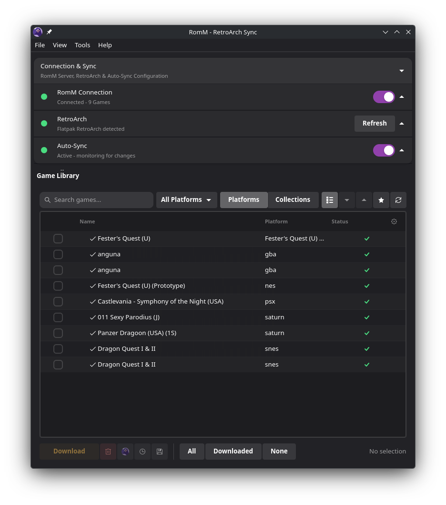

# RomM - RetroArch Sync

A modern, desktop application for managing your retro game library by syncing ROMs, saves, save states, and BIOS files between your [RomM](https://github.com/rommapp/romm) server and RetroArch.



## 📥 Download

<div align="center">

[](https://github.com/rmonk/romm-retroarch-sync/releases)

**[All Releases](https://github.com/rmonk/romm-retroarch-sync/releases)** • **[Issues](https://github.com/rmonk/romm-retroarch-sync/issues)**

</div>

## ✨ Key Features

- **🎮 Game Library Management**: Browse and download your entire RomM game collection.
- **🔑 One-Click Pairing**: Sign in quickly using RomM Client API Pairing Codes (no username or password needed).
- **🌳 Tree & Flat View Modes**: Switch between Platform Tree View and Flat List View with instant toolbar toggles.
- **📊 Independent Column Customization**: Customize displayed columns with independent persistence for Tree vs. Flat view modes (`[Columns_Tree]` and `[Columns_Flat]`).
- **🔤 Click-to-Sort Headers**: Sort games by Name, Platform, Status, or Size directly by clicking column headers.
- **🖱️ Double-Click Row Actions**: Double-click any downloaded ROM to launch it directly in RetroArch, or double-click an un-downloaded ROM to start downloading.
- **⚡ Collapsible Connection & Sync Section**: Top configuration section is collapsible with live color-coded status summary indicators and tooltips when collapsed.
- **🖥️ Dynamic Desktop Environment Support**: Auto-detects or manually sets (`--de=kde|gnome|steamos|xfce|cinnamon|mate|generic`) desktop styling:
  - **GNOME**: Libadwaita rounded cards and header bar.
  - **Non-GNOME (KDE, XFCE, etc.)**: Native system window title bars, traditional window frames, and a top MenuBar (`File`, `View`, `Tools`, `Help`).
  - **SteamOS**: Touch/gamepad-optimized spacing and high-contrast controller focus rings.
- **🔄 Save State & Save File Auto-Sync**: Automatically sync save files and save states between RetroArch and RomM.
- **📥 Automatic BIOS Management**: Detect and download missing system BIOS files directly from your RomM server.
- **🎮 Steam Integration**: Automatically create non-Steam game shortcuts for synced game collections.

## 🚀 Quick Start

### Download AppImage (Recommended)

1. Download the latest `RomM-RetroArch-Sync-v1.7.AppImage` from [Releases](https://github.com/rmonk/romm-retroarch-sync/releases)
2. Make it executable:
   ```bash
   chmod +x RomM-RetroArch-Sync-v1.7.AppImage
   ```
3. Run:
   ```bash
   ./RomM-RetroArch-Sync-v1.7.AppImage
   ```

### Command Line Options

```bash
# Specify desktop environment style manually
./RomM-RetroArch-Sync-v1.7.AppImage --de=kde
./RomM-RetroArch-Sync-v1.7.AppImage --de=gnome
./RomM-RetroArch-Sync-v1.7.AppImage --de=steamos

# Start minimized to system tray
./RomM-RetroArch-Sync-v1.7.AppImage --minimized
```

## 🔧 Configuration

1. **Connect to RomM**: Enter your RomM server URL and click **Pair** using a pairing code generated in RomM.
2. **Verify RetroArch**: Ensure your local or Flatpak RetroArch installation is detected.
3. **Set Download Path**: Choose your ROM destination directory.
4. **Enable Auto-Sync**: Enable automatic background save and save state synchronization.

## 🔗 Links

- **RomM Project**: [GitHub](https://github.com/rommapp/romm)
- **RetroArch**: [Official Site](https://www.retroarch.com/)

## 📜 License

This project is licensed under the GNU General Public License v3.0 - see the [LICENSE](LICENSE) file for details.

---

**Note**: This application requires a running RomM server and is designed for personal game library management. Please ensure you own the games you are downloading and managing.
